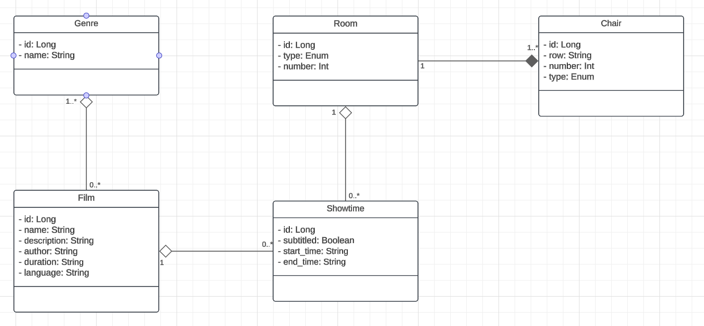

# MS - Cine

This microservice is responsible for managing:

* Films and their genres.
* Showtimes for movies.
* Rooms and their chairs.

## Entities and Relationships

* Film:
    * Represents a movie available for showtimes.
    * Relationships:
    * Many-to-many with Genre.
    * One-to-many with Showtime.

* Genre:
    * Represents a movie genre.
    * Relationships:
    * Many-to-many with Film.

* Showtime:
    * Represents the screening time of a film in a specific room.
    * Relationships:
    * Many-to-one with Film.
    * Many-to-one with Room.

* Room:
    * Represents a cinema room.
    * Relationships:
    * One-to-many with Chair.
    * One-to-many with Showtime.

* Chair:
    * Represents a chair within a room.
    * Relationships:
    * Many-to-one with Room.